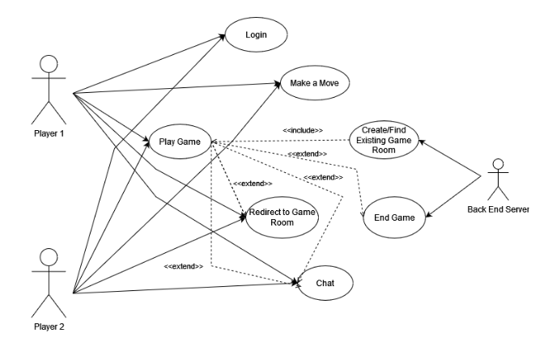
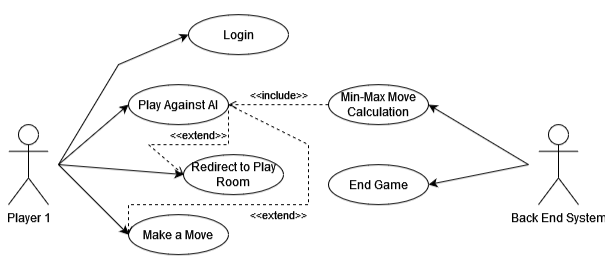
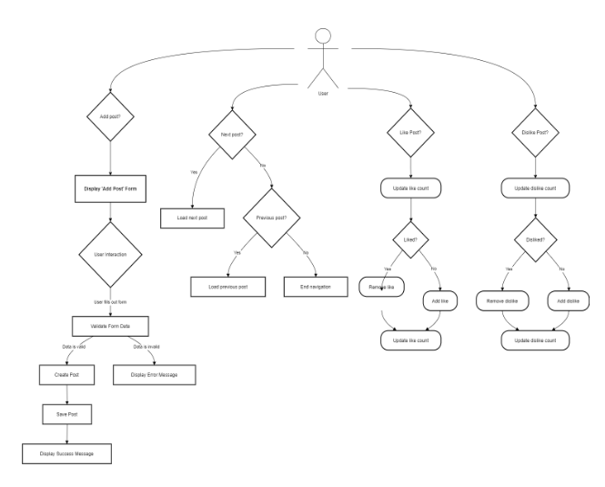

# TicTakYo – Online Multiplayer Tic-Tac-Toe Social Platform

## Overview

TicTakYo is a real-time multiplayer web application that combines social media features with a Tic-Tac-Toe gaming experience. Users can register, follow other players, create posts, chat in real-time, and play Tic-Tac-Toe against others or an AI opponent.

## Features

- **User Authentication:** Secure registration and login system.
- **Social Media Integration:** Follow/unfollow users, like posts, and view a social feed.
- **Real-time Multiplayer:** Play live Tic-Tac-Toe matches against other users using WebSockets.
- **AI Gameplay:** Play against an AI-powered bot using the Minimax algorithm.
- **Live Chat:** Communicate with other players in real-time.
- **Game History & Stats:** Track past matches and performance statistics.
- **Scalable Database:** MongoDB stores user data, posts, and game history.

## Technology Stack

- **Frontend:** HTML, Vanilla JavaScript
- **Backend:** Node.js, Express
- **Database:** MongoDB
- **Real-time Communication:** Socket.io
- **Authentication & Security:** Password hashing and authentication handling
- **Deployment:** Docker

## Architecture

The project follows a modular structure:

1. **Frontend Module:** Handles user interactions and UI components.
2. **Backend Module:** Manages game logic, user authentication, and API endpoints.
3. **Data Management Module:** Stores user profiles, game history, and posts using MongoDB.

### Architectural Representation

A user journey typically involves:
1. **Registration/Login** – Users create an account and log in.
2. **Dashboard Features**:
   - View a personalized social feed.
   - Like and interact with posts.
   - Start a new Tic-Tac-Toe match.
3. **Multiplayer Gameplay**:
   - Join a match with another logged-in user via WebSockets.
   - Play against a bot using the Minimax AI algorithm.
4. **Post-Match Updates**:
   - The system records the game outcome.
   - User statistics are updated accordingly.
  
## Artifacts
Visual artifacts showcasing key aspects of the project can be found in the sprint-req-artifacts folder

## Installation

1. Clone the repository:
   ```sh
   git clone https://github.com/your-username/tictakyo.git
   ```
2. Navigate to the project directory:
   ```sh
   cd tictakyo
   ```
3. Install dependencies:
   ```sh
   npm install
   ```
4. Start the application:
   ```sh
   node server.js
   ```

## Illustrations

### Technology Stack Diagram


### Player Vs. Player Interaction UML Diagram


### Player Vs. AI Interaction UML Diagram


### User Actions Flow Diagram for Posting on Dashboard


## Contribution

We welcome contributions! Feel free to fork the repository and submit pull requests.

---

📌 **Team Members:**
- Nick Hausler
- Zach Alwin
- Vinayak Jha
- Kristin Boeckmann
- Lisa Phan
